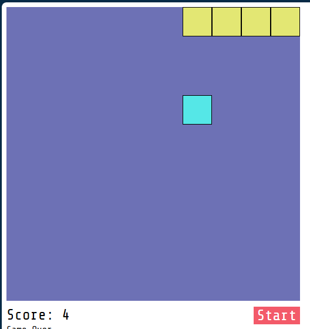

# 🐍 Snake Game

Este es un juego clásico de Snake (la serpiente) desarrollado con tecnologías web: **HTML**, **CSS** y **JavaScript**. El objetivo es mover la serpiente, comer la comida y evitar chocar contra las paredes o contra ti mismo.

## 🧪 Tecnologías utilizadas

- HTML5
- CSS3
- JavaScript (vanilla)

## 🎮 Cómo jugar

1. Abre el archivo `index.html` en tu navegador web.
2. Usa las teclas de flecha (⬆️⬇️⬅️➡️) para mover la serpiente.
3. Come la comida 🟩 para crecer.
4. Evita chocar contra los bordes o contra ti mismo, ¡o perderás!

## 📁 Estructura del proyecto

├── index.html # Archivo principal HTML
├── README.md # Documentación del proyecto
├── script.js # Lógica del juego (JavaScript)
└── styles.css # Estilos del juego (CSS)

## 📸 Captura

()

## 🌐 Juega en línea

Puedes jugar la versión en línea aquí:  
👉 [Jugar Snake](https://gutierrezcesar.github.io/Snake/)  

## 🚀 Cómo ejecutar

1. Clona este repositorio:
   
   git clone https://github.com/GutierrezCesar/Snake.git
